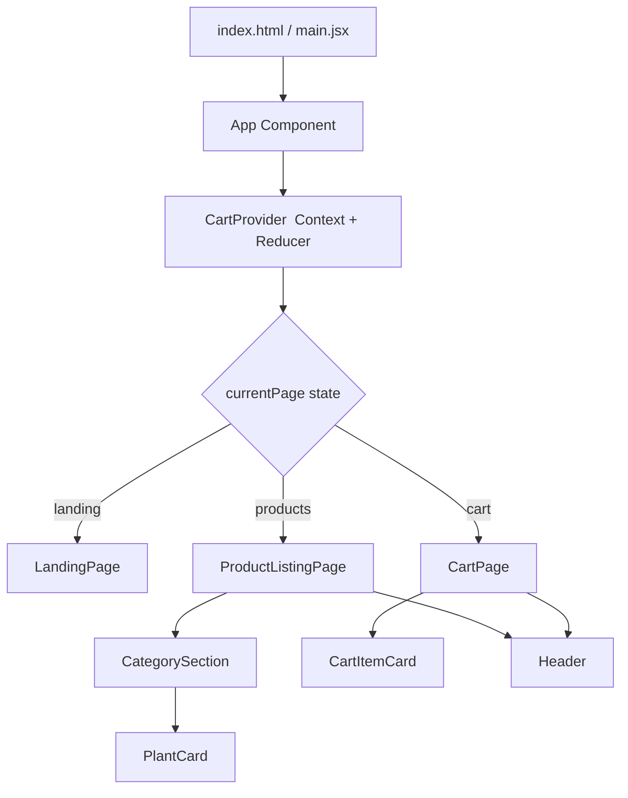

# Design Document

## Overview

Paradise Nursery is a React single-page application (SPA) for browsing and purchasing house plants. The app has three views — Landing, Product Listing, and Cart — rendered within a single root component. A shared cart state (managed via React Context + `useReducer`) flows through all views, keeping the cart icon count and "Add to Cart" button states consistent without any server round-trips or persistence layer.

The design prioritises simplicity: no routing library is required (view switching is handled by a single `currentPage` state variable), and no backend is involved. All plant data is defined as a static in-memory array.

---

## Architecture



**Key architectural decisions:**

- **Single `currentPage` state** in `App` drives which view is rendered — avoids a routing dependency for a three-page app.
- **`CartContext` + `useReducer`** provides a predictable, testable state machine for all cart mutations. The reducer is a pure function, making it ideal for property-based testing.
- **Static plant data** lives in `src/data/plants.js` — a plain array of plant objects. No API calls needed.
- **Vite + React** for fast development and build tooling.

---

## Components and Interfaces

### `App`
- Owns `currentPage` state (`'landing' | 'products' | 'cart'`).
- Wraps the entire tree in `<CartProvider>`.
- Renders the correct page component based on `currentPage`.
- Passes `navigate(page)` callback down to children.

### `CartProvider` / `useCart`
- Provides `CartContext` with `{ state, dispatch }`.
- `state.items`: `CartItem[]` — the source of truth for cart contents.
- `dispatch` accepts actions: `ADD_ITEM`, `REMOVE_ITEM`, `INCREMENT`, `DECREMENT`.
- Exported hook `useCart()` gives any component access to cart state and dispatch.

### `LandingPage`
- Props: `onGetStarted: () => void`
- Renders company name, background image, description paragraph, and "Get Started" button.

### `Header`
- Props: `onLogoClick: () => void`, `onCartClick: () => void`
- Reads `totalItems` from `useCart()`.
- Renders company name, logo, tagline, and `CartIcon` with item count.

### `ProductListingPage`
- Props: `navigate: (page: string) => void`
- Renders `<Header>` and a list of `<CategorySection>` components, one per category.

### `CategorySection`
- Props: `category: string`, `plants: Plant[]`
- Renders a section heading and a `<PlantCard>` for each plant.

### `PlantCard`
- Props: `plant: Plant`
- Reads cart state via `useCart()` to determine if the plant is already in the cart.
- Renders thumbnail, name, price, description, and "Add to Cart" button.
- Button is disabled when `plant.id` is present in cart items.

### `CartPage`
- Props: `navigate: (page: string) => void`
- Renders `<Header>`, a list of `<CartItemCard>` components, summary totals, and `<CheckoutButton>`.

### `CartItemCard`
- Props: `item: CartItem`
- Renders thumbnail, name, unit price, subtotal, increase/decrease buttons, and delete button.
- Dispatches `INCREMENT`, `DECREMENT`, or `REMOVE_ITEM` on user interaction.

### `CheckoutButton`
- Renders a button labelled "Checkout". (Checkout flow is out of scope; button is present per requirements.)

---

## Data Models

### `Plant`
```ts
interface Plant {
  id: string;          // unique identifier, e.g. "snake-plant"
  name: string;        // display name, e.g. "Snake Plant"
  price: number;       // unit price in USD, e.g. 12.99
  description: string; // short description
  thumbnail: string;   // image path or URL
  category: string;    // category name, e.g. "Air Purifying"
}
```

### `CartItem`
```ts
interface CartItem {
  plant: Plant;
  quantity: number;    // always >= 1 while in cart
}
```

### `CartState`
```ts
interface CartState {
  items: CartItem[];
}
```

### Cart Actions
```ts
type CartAction =
  | { type: 'ADD_ITEM';    plant: Plant }
  | { type: 'REMOVE_ITEM'; plantId: string }
  | { type: 'INCREMENT';   plantId: string }
  | { type: 'DECREMENT';   plantId: string };
```

### Reducer Invariants
- `ADD_ITEM`: adds `{ plant, quantity: 1 }` if not already present; no-op if already present.
- `INCREMENT`: increases quantity by 1 for the matching item.
- `DECREMENT`: decreases quantity by 1; if quantity was 1, removes the item entirely.
- `REMOVE_ITEM`: removes the item regardless of quantity.
- `items` never contains an entry with `quantity <= 0`.

### Derived Values (computed, not stored)
- `totalItems`: `items.reduce((sum, i) => sum + i.quantity, 0)`
- `totalCost`: `items.reduce((sum, i) => sum + i.plant.price * i.quantity, 0)`
- `subtotal(item)`: `item.plant.price * item.quantity`

### Static Plant Data (`src/data/plants.js`)
At least 6 plants across at least 2 categories. Example structure:
```js
export const plants = [
  { id: 'snake-plant', name: 'Snake Plant', price: 12.99, description: '...', thumbnail: '...', category: 'Air Purifying' },
  { id: 'lavender',    name: 'Lavender',    price: 9.99,  description: '...', thumbnail: '...', category: 'Aromatic' },
  // ...
];
```

---

## Correctness Properties

*A property is a characteristic or behavior that should hold true across all valid executions of a system — essentially, a formal statement about what the system should do. Properties serve as the bridge between human-readable specifications and machine-verifiable correctness guarantees.*

The cart reducer is a pure function, making it well-suited for property-based testing. The derived display values (totalItems, totalCost, subtotals) are arithmetic computations over cart state, also ideal for PBT. UI rendering properties (PlantCard, CartItemCard, CategorySection) can be tested with generated data.

---

### Property 1: Cart icon count reflects total items

*For any* cart state (including empty), the value displayed in the Cart_Icon SHALL equal the sum of all item quantities in the cart.

**Validates: Requirements 2.3, 6.6, 9.2**

---

### Property 2: Category sections match plant data

*For any* array of plants with varying categories, the Product_Listing_Page SHALL render exactly one section per unique category, each section heading SHALL match the category name, and each section SHALL contain exactly one PlantCard per plant in that category.

**Validates: Requirements 3.1, 3.2, 3.3**

---

### Property 3: PlantCard displays all plant fields

*For any* valid Plant object, the rendered PlantCard SHALL display the plant's thumbnail image, name, price, and description.

**Validates: Requirements 3.4**

---

### Property 4: Add to Cart button state reflects cart membership

*For any* plant and any cart state, the PlantCard "Add to Cart" button SHALL be enabled if and only if the plant is NOT present in the cart.

**Validates: Requirements 4.1, 4.3, 7.5, 8.2, 9.3**

---

### Property 5: ADD_ITEM adds plant with quantity one and increments total

*For any* cart state that does not contain a given plant, dispatching ADD_ITEM for that plant SHALL result in the cart containing that plant with quantity 1, and totalItems SHALL increase by exactly 1.

**Validates: Requirements 4.2, 4.4**

---

### Property 6: CartItemCard count matches cart items

*For any* cart state, the Cart_Page SHALL render exactly one CartItemCard per item in the cart.

**Validates: Requirements 5.1, 7.3**

---

### Property 7: CartItemCard displays correct fields and controls

*For any* CartItem, the rendered CartItemCard SHALL display the plant's thumbnail, name, unit price, the subtotal (unit price × quantity), an increase button, a decrease button, and a delete button.

**Validates: Requirements 5.2, 5.3, 6.1, 7.1**

---

### Property 8: Cart summary totals are arithmetically correct

*For any* cart state, the Cart_Page SHALL display a total item count equal to the sum of all quantities, and a total cost equal to the sum of (unit price × quantity) for every item.

**Validates: Requirements 5.4, 5.5**

---

### Property 9: INCREMENT increases item quantity by one

*For any* cart state containing at least one item, dispatching INCREMENT for an item SHALL increase that item's quantity by exactly 1 while leaving all other items unchanged.

**Validates: Requirements 6.2**

---

### Property 10: DECREMENT decreases quantity or removes item

*For any* cart item, dispatching DECREMENT SHALL decrease the item's quantity by 1 if quantity > 1, or remove the item entirely if quantity == 1. In either case, no item in the cart SHALL ever have quantity ≤ 0.

**Validates: Requirements 6.3, 8.1, 8.3**

---

### Property 11: REMOVE_ITEM removes item and decreases total by removed quantity

*For any* cart state containing a given item with quantity Q, dispatching REMOVE_ITEM for that item SHALL result in the item no longer appearing in the cart, and totalItems SHALL decrease by exactly Q.

**Validates: Requirements 7.2, 7.4**

---

## Error Handling

Since this is a pure front-end app with no network calls or user-supplied data persistence, error scenarios are limited:

| Scenario | Handling |
|---|---|
| `ADD_ITEM` dispatched for a plant already in cart | Reducer is a no-op; state unchanged |
| `DECREMENT` / `REMOVE_ITEM` dispatched for a plant not in cart | Reducer is a no-op; state unchanged |
| `INCREMENT` dispatched for a plant not in cart | Reducer is a no-op; state unchanged |
| Plant data array is empty | Product_Listing_Page renders with no category sections (empty state) |
| Cart is empty on Cart_Page | Cart_Page renders with no CartItemCards; totals display as 0 |
| Missing plant thumbnail image | `` renders with `alt` text; broken image icon shown by browser |

All reducer actions are designed to be safe to call with any input — they silently ignore invalid operations rather than throwing.

---

## Testing Strategy

### Unit / Example Tests

Focus on specific scenarios and integration points:

- `LandingPage` renders company name, description, background image, and "Get Started" button
- Clicking "Get Started" calls the navigate callback with `'products'`
- `Header` renders company name, logo, tagline, and cart icon
- Clicking logo calls navigate with `'landing'`; clicking cart icon calls navigate with `'cart'`
- `CartPage` renders a Checkout button
- `App` renders `CartProvider` wrapping all page components (architectural smoke test for Requirement 9.1)

### Property-Based Tests

Use **fast-check** (JavaScript PBT library) for all property tests. Each test runs a minimum of **100 iterations**.

Each test is tagged with a comment in the format:
`// Feature: paradise-nursery-shopping-app, Property N: <property text>`

| Property | Test Description |
|---|---|
| Property 1 | Generate random CartState → render Header → assert displayed count = sum of quantities |
| Property 2 | Generate random Plant[] with random categories → render ProductListingPage → assert section count, headings, and PlantCard count |
| Property 3 | Generate random Plant → render PlantCard → assert all fields displayed |
| Property 4 | Generate random Plant + CartState (with/without plant) → render PlantCard → assert button enabled iff plant absent |
| Property 5 | Generate random CartState (without plant) + random Plant → dispatch ADD_ITEM → assert item present with qty 1, totalItems +1 |
| Property 6 | Generate random CartState → render CartPage → assert CartItemCard count = items.length |
| Property 7 | Generate random CartItem → render CartItemCard → assert all fields and buttons present |
| Property 8 | Generate random CartState → render CartPage → assert total items and total cost match arithmetic |
| Property 9 | Generate random CartState with ≥1 item → dispatch INCREMENT → assert target qty +1, others unchanged |
| Property 10 | Generate random CartItem (qty ≥ 1) → dispatch DECREMENT → assert qty-1 or removal; no qty ≤ 0 |
| Property 11 | Generate random CartState with ≥1 item → dispatch REMOVE_ITEM → assert item absent, totalItems decreases by Q |

### Test File Structure

```
src/
  __tests__/
    unit/
      LandingPage.test.jsx
      Header.test.jsx
      CartPage.test.jsx
      App.test.jsx
    property/
      cartReducer.property.test.js   # Properties 5, 9, 10, 11
      cartDisplay.property.test.jsx  # Properties 1, 6, 7, 8
      productListing.property.test.jsx # Properties 2, 3, 4
```
